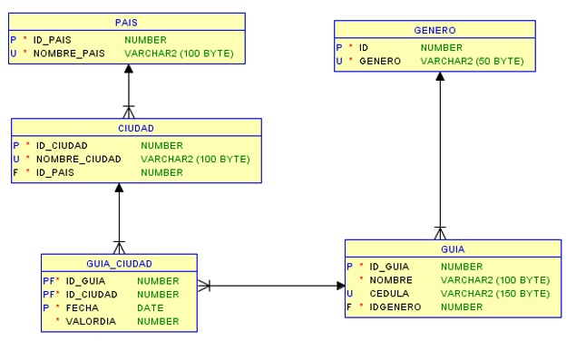

# Tourism Guide Project - Entrega I

Pontificia Universidad Javeriana  
Administración de Bases de Datos – Proyecto del semestre  

---

## 📖 Descripción del problema

El proyecto consiste en la implementación de una base de datos para el manejo de **ventas virtuales de fotos tomadas en distintos destinos turísticos**.  
A partir del modelo conceptual de entidades de los **paquetes de turismo**, se deben construir tablas y procesos que permitan consultas analíticas (OLAP) sobre los valores cobrados por los guías turísticos en diferentes periodos y ubicaciones.

---

## 📊 Modelo de datos

Un guía puede trabajar en varias ciudades, y cada ciudad puede tener varios guías.  
Las reglas principales del modelo son:

- **Llaves primarias:** Surrogate Keys (`ID NUMBER(10,0) GENERATED BY DEFAULT AS IDENTITY`).  
- **Llaves foráneas:** Definidas según las relaciones entre entidades (`IDXXXXX`).  
- **Llaves naturales:** Declaradas como `UNIQUE`.  
- **Restricciones:**
  - Ningún atributo admite nulos.  
  - `VALORDIA` no puede ser negativo, con valor por defecto `0`.  
  - `FECHA` tiene `SYSDATE` como valor por defecto.  
  - `GENERO` solo admite valores `'M'` o `'F'`.  
  - La PK de `GUIA_CIUDAD` incluye la **fecha**.

### Diagrama del diseño

---

## 🚀 Actividades realizadas

1. **Modelo denormalizado para OLAP**  
   - Creación de un esquema en estrella para medir los valores cobrados por los guías en distintos periodos y ubicaciones (jerarquía país → ciudad).

2. **Diagrama físico y creación de tablas en Orion**  
   - Definición de tablas con Surrogate Keys como PK.  

3. **Carga inicial de datos**  
   - Creación de una **tabla temporal de staging** con datos generados aleatoriamente.  
   - Desarrollo de **procedimientos almacenados** para cargar las tablas destino desde la tabla temporal.  

4. **Carga con SQL*Loader**  
   - Uso de Oracle SQL*Loader para cargar datos en la tabla temporal a partir de archivos `.ctl` y `.dat`.  

---

## 👥 Integrantes

- Katheryn Sofía Guasca  
- Juan Luis Ardila
- Sebastián Mendez
- x x x x  

---
